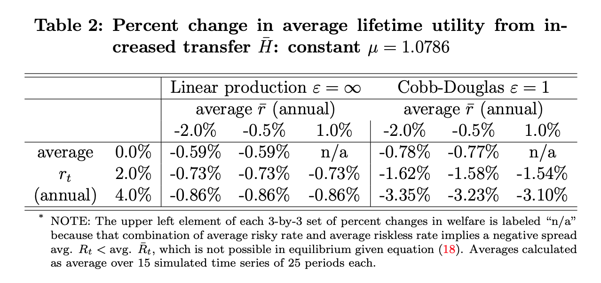

# Replication of "Public Debt, Interest Rates, and Negative Shocks" (Evans, R. 2020) 

> This replication study was part of our evaluation for the course [Numerical Methods](https://floswald.github.io/NumericalMethods/) at SciencesPo Paris in Spring 2021
> 
> The functions used to replicate this paper are:

```@autodocs
Modules = [Evans2020]
```

## Case number 1 : $\varepsilon$ = 1 and $\mu$ is constant

### We run the simulation code for this first case using 

```julia
julia> using Evans2020

julia> include("FUNC_NPC.jl")

# Create OUTPUT directory if does not already exist
julia>  cur_path = string(@__DIR__)
julia>  output_fldr = "OUTPUT"
julia>  output_dir = joinpath(cur_path, output_fldr)
julia>  if !ispath(output_dir)
         mkpath(output_dir)
        end 

###
#------------------------------------------------------------------------
#Set exogenous parameters
#------------------------------------------------------------------------
#yrs_in_per = integer >= 1, number of years in a model period
#beta_an    = scalar in (0, 1), annual discount factor
#beta       = scalar in (0, 1), model period discount factor
#gamma      = scalar >= 1, coefficient of relative risk aversion
#c_min      = scalar > 0, minimum individual consumption
#K_min      = scalar > 0, minimum aggregate capital stock
#n_1        = scalar >= 0, exogenous labor supply when young
#n_2        = scalar >= 0, exogenous labor supply when old
#n_vec      = (2,) vector, lifetime exogenous labor supply
#alpha      = scalar in (0, 1), capital share of income
#delta_an   = scalar in (0, 1], annual depreciation rate
#delta      = scalar in (0, 1], model period depreciation rate
#rho_an     = scalar in (-1, 1), annual persistence of normally
#             distributed TFP process
#rho        = scalar in (-1, 1), model period persistence of normally
#             distributed TFP process
#mu         = scalar, unconditional mean of normally distributed TFP
#             process
#sigma_an   = scalar > 0, annual standard deviation of normally
#             distributed TFP process
#rho_sum    = scalar, recursive geometric sum of rho ** 2
#y_ind      = integer >= 0, index of yrs_in_per
#sigma      = scalar > 0, model period standard deviation of normally
#             distributed TFP process
#A_min      = scalar >= 0, minimum value in support of lognormally
#             distributed TFP process
#z_min      = scalar, minimum value in support of normally distributed
#             TFP process
#Hbar_vec   = (Hbar_size,) vector, values of Hbar
#Hbar_size  = integer >= 1, number of values of Hbar
#k20_vec    = (Hbar_size,) vector, values of k20
#k20_size   = integer >= 1, number of values of k20_vec
#z0         = scalar, initial normally distributed TFP value
#T          = integer > 1, maximum number of periods to simulate
#S          = integer >= 1, number of simulations
#rand_seed  = integer > 0, random seed for simulation
#------------------------------------------------------------------------
#'''

julia>  yrs_in_per = 25
julia>  beta_an = 0.96
julia>  beta = beta_an^yrs_in_per
julia>  gamma = 2.2
julia>  c_min = 1e-5
julia>  K_min = 1e-5

# Firm parameters
julia>  alpha = 1/3
julia>  epsilon = 1.0  # Inf
julia>  delta_an = 0.0
julia>  delta = 1 - ((1 - delta_an)^yrs_in_per)
julia>  nvec = Array([1.0, 0.0])

# Aggregate shock z parameters
julia>  rho_an = 0.95
julia>  rho = rho_an^yrs_in_per
julia>  mu_an = 0.0
julia>  sigma_an = 0.2  # 0.4946
julia>  rho_sum = 0.0
julia>  rho2_sum = 0.0
julia>  for y_ind in range(0,stop = (yrs_in_per-1),step = 1)
            rho_sum = rho_sum + rho_an^y_ind
            rho2_sum = rho2_sum + rho_an^(2*y_ind)
        end 
julia>  sigma = sqrt(rho2_sum*(sigma_an^2))
julia>  mu = mu_an*rho_sum
julia>  A_min = 0.0
julia>  if A_min == 0.0
             z_min = -Inf
        elseif (A_min > 0.0) && (A_min < exp(mu))
              z_min = log(A_min)
        elseif A_min >= exp(mu)
        print("Parameter Error: A_min >= e^(mu)")
        end
        

# Set government parameters, transfer parameters, and initial values
julia>  Hbar_vec = Array([0.0, 0.05])
# self.Hbar_vec = Array([0.0, 0.05, 0.11, 0.17])
julia>  Hbar_size = length(Hbar_vec)
julia>  Hbar = Hbar_vec[1]
julia>  tau = nothing
julia>  z0 = mu

# Set simulation parameters
julia>  T = 25
julia>  S = 15
julia>  rand_seed = 25

# print("sigma")
# print(sigma)
# print(" ")
# print("beta")
# print(beta)
# print(" ")


"""
------------------------------------------------------------------------
Calibrate beta, mu, gamma
------------------------------------------------------------------------
"""

julia>  avg_rtp1_size = 3
julia>  avg_rtp1_an_vec = Array(range(0.00,stop = 0.04,length = avg_rtp1_size))
julia>  avg_Rtp1_vec = (1 .+ avg_rtp1_an_vec).^yrs_in_per
julia>  avg_rbart_size = 3
julia>  avg_rbart_an_vec = Array(range(-0.02,stop = 0.01, length = avg_rbart_size))
julia>  avg_Rbart_vec = (1 .+ avg_rbart_an_vec).^yrs_in_per

# print("avg_Rtp1_vec")
# print(avg_Rtp1_vec)
# print(" ")
# print("avg_Rbart_vec")
# print(avg_Rbart_vec)
# print(" ")

julia>  avgRtp1_mat = repeat(reshape(avg_Rtp1_vec,(avg_rtp1_size, 1)), 1, avg_rbart_size)
julia>  avgRbart_mat = repeat(reshape(avg_Rbart_vec,(1, avg_rbart_size)), avg_rtp1_size, 1)
julia>  avgRtp1_gt_avgRbart = ((avgRtp1_mat - avgRbart_mat) .> 0) 
# print(avgRtp1_gt_avgRbart)

# Calibrate mu using linear production expected MPK
julia>  mu_vec = 1.0786 .* fill!(similar(avg_Rtp1_vec), 1)
# mu_vec = log.(avg_Rtp1_vec) .- log(alpha) .- ((sigma^2) / 2)
julia>  mu_mat = repeat(reshape(mu_vec,(avg_rtp1_size, 1)), 1, avg_rbart_size)
julia>  mu_mat[.!avgRtp1_gt_avgRbart] .= NaN 

# Calibrate beta using Cobb-Douglas expected values expression for beta
julia>  beta_vec = (alpha / (1 - alpha)) .* (1 ./ (2 * avg_Rtp1_vec)) 
julia>  beta_an_vec = beta_vec.^(1 / yrs_in_per)
julia>  beta_mat = repeat(reshape(beta_vec,(avg_rtp1_size, 1)), 1, avg_rbart_size)
julia>  beta_mat[.!avgRtp1_gt_avgRbart] .=  NaN

# Calibrate gamma
julia>  gamma_mat = ((log.(avgRtp1_mat) - log.(avgRbart_mat)) ./ (sigma^2))
julia>  gamma_mat[.!avgRtp1_gt_avgRbart]  .=  NaN

# Calibrate x_1
julia>  x1_mat = (((1 - alpha) * exp.(mu_mat .+ ((sigma ^ 2) / 2)) .* ((2 * beta_mat) .^alpha)) .^ (1 / (1 - alpha)))

# Calibrate kbar_2
julia>  kbar2_mat = 2 .* beta_mat .* x1_mat
julia>  Hbar_vec[2] = 0.05 * kbar2_mat[1, 1] # 1.0786
# print("Hbar_vec = ", Hbar_vec)

# Calibrate x_1 array for different values of x1, given calibration
julia>  x1_mat2 = transpose(x1_mat)
julia>  x1_arr = zeros(3, avg_rtp1_size, avg_rbart_size) 
julia>  x1_arr[:, 1, :] = x1_mat2 
julia>  x1_arr[:, 2, :] = 0.5 .* x1_mat2
julia>  x1_arr[:, 3, :] = 0.0 .* x1_mat2 

# Calibrate sigma vector of 5% and 10% increases
julia>  sigma_vec = zeros(3)
julia>  sigma_vec[1] = sigma
julia>  sigma_vec[2] = 1.05 * sigma
julia>  sigma_vec[3] = 1.10 * sigma

# Calibrate corresponding mu_arr that holds the expected value of the
# TFP shock while expanding the variance. If ExpA is the expected value of
# the TFP shock, then ExpA = exp.(mu .+ (sig^2) / 2), then
# log.(ExpA) = mu .+ (sig^2) / 2
julia>  ExpA = mu_mat .+ (sigma ^ 2) / 2
julia>  mu_mat2 = transpose(mu_mat)
julia>  mu_arr = zeros(3, avg_rtp1_size, avg_rbart_size)
julia>  mu_arr[:, 1, :] = mu_mat2
julia>  mu_arr[:, 2, :] = mu_mat2
julia>  mu_arr[:, 3, :] = mu_mat2
# mu_arr[:, :, 2] = ExpA .- (sigma_vec[2] ^ 2) / 2
# mu_arr[:, :, 3] = ExpA .- (sigma_vec[3] ^ 2) / 2

# print("mu_mat")
# print(mu_mat)
# print(" ")
# print("beta_mat")
# print(beta_mat)
# print(" ")
# print("gamma_mat")
# print(gamma_mat)
# print(" ")
# print("x1_mat")
# print(x1_mat)
# print(" ")
# print("kbar2_mat")
# print(kbar2_mat)
# print(" ")
# print("x1_arr 1")
# print(x1_arr[:, :, 1])
# print(" ")
# print("x1_arr 2")
# print(x1_arr[:, :, 2])
# print(" ")
# print("x1_arr 3")
# print(x1_arr[:, :, 3])
# print(" ")
# print("sigma_vec")
# print(sigma_vec)
# print(" ")
# print("mu_arr 1")
# print(mu_arr[:, :, 1])
# print(" ")
# print("mu_arr 2")
# print(mu_arr[:, :, 2])
# print(" ")
# print("mu_arr 3")
# print(mu_arr[:, :, 3])
# print(" ")

julia>  default_arr = zeros(S, T, avg_rbart_size, avg_rtp1_size, 3, 2, Hbar_size)

julia>  Random.seed!(rand_seed) 
julia>  unif_mat = rand(Uniform(0, 1), (S, T))

# First three dimensions of zt_arr correspond to mu_arr in different order
julia>  zt_arr = zeros(S, T, avg_rbart_size, avg_rtp1_size, 3)

julia>  cut_lb = 0
julia>  eps_t = 0
julia>  z_t = 0
julia>  z_tm1 = 0

julia>  for sig_ind in range(1, stop=(3), step=1)
            sigma = sigma_vec[sig_ind]
             for avgrtp1_ind in range(1, stop=(avg_rtp1_size), step=1)
                for avgrbart_ind in range(1, stop=(avg_rbart_size), step=1)
                  mu = mu_arr[avgrbart_ind, sig_ind, avgrtp1_ind]
                    for s_ind in range(1, stop=(S), step=1)
                         for t_ind in range(1, stop=(T), step=1)
                            unif = unif_mat[s_ind, t_ind]
                                 if t_ind == 1 && avgRtp1_gt_avgRbart[avgrtp1_ind,avgrbart_ind] == true
                                    cut_lb = z_min - mu
                                    eps_t = trunc_norm_draws(unif, 0, sigma, cut_lb)
                                    z_t = mu + eps_t
                                 elseif ((t_ind > 1) && avgRtp1_gt_avgRbart[avgrtp1_ind,avgrbart_ind] == true)
                                    z_tm1 = zt_arr[s_ind, t_ind - 1, avgrbart_ind, avgrtp1_ind, sig_ind]
                                    cut_lb = z_min - rho * z_tm1 - (1 - rho) * mu
                                    eps_t = trunc_norm_draws(unif, 0, sigma, cut_lb)
                                     z_t = rho * z_tm1 + (1 - rho) * mu .+ eps_t 
                                  else
                                      z_t = NaN
                                  end
                             zt_arr[s_ind, t_ind, avgrbart_ind,  avgrtp1_ind, sig_ind] = z_t  
                           end 
                        end 
                     end 
                 end 
            end 

julia>  c1t_arr = zero(default_arr)
julia>  c2t_arr = zero(default_arr)
julia>  ut_arr = zeros(S, T - 1, avg_rbart_size, avg_rtp1_size, 3, 2, Hbar_size)
julia>  Ht_arr = zero(default_arr)
julia>  wt_arr = zero(default_arr)
julia>  rt_arr = zero(default_arr)
julia>  k2t_arr = zero(default_arr)
julia>  rbart_arr = zero(default_arr)
julia>  rbart_an_arr = zero(default_arr)
julia>  EulErr_arr = zero(default_arr)
julia>  PathTime_arr = zeros(avg_rbart_size, S, avg_rtp1_size, 3, 2, Hbar_size)
julia>  s_ind_arr = zeros(avg_rbart_size, S, avg_rtp1_size, 3, 2, Hbar_size)

julia>  for rtp1_ind in range(1, stop=(avg_rtp1_size), step=1) 
            for rbart_ind in range(1, stop=(avg_rbart_size), step=1) 
                 kbar2_mat2 = (!iszero).(kbar2_mat)
                 k2t_arr[:, 1, rbart_ind, rtp1_ind, :, :, :] .=  kbar2_mat2[rtp1_ind, rbart_ind]
            end
        end

julia>  mu_in = 0
julia>  sigma_in = 0
julia>  x1_in = 0
julia>  z0_vec_in = 0
julia>  gamma_in = 0
julia>  beta_in = 0
julia>  k20_in = 0
julia>  simulations = 0
julia>  H_ind = 1
julia>  risk_type_ind = 1
julia>  risk_val_ind = 1
julia>  avgrtp1_ind = 1
julia>  avgrbart_ind = 1
julia>  timepaths_s = 0
julia>  for H_ind in 1:Hbar_size
            Hbar_in = Hbar_vec[H_ind]
              for risk_type_ind in 1:2 #0=xval, 1=sigval
                 for risk_val_ind in 1:3
                        for avgrtp1_ind in 1:avg_rtp1_size
                          for avgrbart_ind in 1:avg_rbart_size
                             if avgRtp1_gt_avgRbart[avgrtp1_ind, avgrbart_ind]
                                   simulations = []
                                   beta_in = beta_mat[avgrtp1_ind, avgrbart_ind]
                                   gamma_in = gamma_mat[avgrtp1_ind, avgrbart_ind]
                                   k20_in = kbar2_mat[avgrtp1_ind, avgrbart_ind]
                                  if risk_type_ind == 1
                                        mu_in = mu_mat[avgrtp1_ind, avgrbart_ind]
                                        sigma_in = sigma_vec[1]
                                        x1_in = x1_arr[avgrbart_ind, risk_val_ind, avgrtp1_ind]
                                        z0_vec_in = zt_arr[:, 1, avgrbart_ind, avgrtp1_ind, 1]
                                   elseif risk_type_ind == 2 
                                         mu_in = mu_arr[avgrbart_ind, risk_val_ind, avgrtp1_ind]
                                         sigma_in = sigma_vec[risk_val_ind]
                                         x1_in = x1_mat[avgrtp1_ind, avgrbart_ind]
                                         z0_vec_in = zt_arr[ :, 1, avgrbart_ind, avgrtp1_ind, risk_val_ind,]
                                    end

                                    for s_ind in 1:S
                                       z0_in = z0_vec_in[s_ind]
                                        if risk_type_ind == 1
                                                zt_vec_in = zt_arr[s_ind, :, avgrbart_ind, avgrtp1_ind, 1]
                                        elseif risk_type_ind == 2
                                            zt_vec_in = zt_arr[s_ind, :, avgrbart_ind, avgrtp1_ind, risk_type_ind,]
                                        end
                                     timepaths_s = sim_timepath(
                                         Hbar_in, beta_in, gamma_in, k20_in,
                                         sigma_in, x1_in, T, z0_in, z_min, rho,
                                          mu_in, nvec, epsilon, alpha, delta, tau,
                                          c_min, K_min, A_min, yrs_in_per,
                                          H_ind,
                                          risk_type_ind,
                                          risk_val_ind,
                                          avgrtp1_ind,
                                          avgrbart_ind, s_ind,
                                          zt_vec_in,
                                          rand_seed)
                                     push!(simulations, timepaths_s)
                                  end
                        
                        for s_ind in 1:S
                            s_ind_arr[avgrbart_ind, s_ind, avgrtp1_ind, risk_val_ind, risk_type_ind, H_ind] = simulations[s_ind][6] # original S_ind
                            default_arr[s_ind, :, avgrbart_ind, avgrtp1_ind, risk_val_ind, risk_type_ind, H_ind] = simulations[s_ind][8]  # default_vec
                            c1t_arr[s_ind, :, avgrbart_ind, avgrtp1_ind, risk_val_ind, risk_type_ind, H_ind] = (!iszero).(simulations[s_ind][9])  # c1t_vec
                            c2t_arr[s_ind, :, avgrbart_ind, avgrtp1_ind, risk_val_ind, risk_type_ind, H_ind] = (!iszero).(simulations[s_ind][10])  # c2t_vec
                            ut_arr[s_ind, :, avgrbart_ind, avgrtp1_ind, risk_val_ind, risk_type_ind, H_ind] = simulations[s_ind][11]  # ut_vec
                            Ht_arr[s_ind, :, avgrbart_ind, avgrtp1_ind, risk_val_ind, risk_type_ind, H_ind] = (!iszero).(simulations[s_ind][12])  # Ht_vec
                            wt_arr[s_ind, :, avgrbart_ind, avgrtp1_ind, risk_val_ind, risk_type_ind, H_ind] = (!iszero).(simulations[s_ind][13])  # wt_vec
                            rt_arr[s_ind, :, avgrbart_ind, avgrtp1_ind, risk_val_ind, risk_type_ind, H_ind] = (!iszero).(simulations[s_ind][14])  # rt_vec
                            pop!(simulations[s_ind][15])
                            k2t_arr[s_ind, :, avgrbart_ind, avgrtp1_ind, risk_val_ind, risk_type_ind, H_ind] = (!iszero).(simulations[s_ind][15])  #        k2t_vec[:-1]
                            rbart_arr[s_ind, :, avgrbart_ind, avgrtp1_ind, risk_val_ind, risk_type_ind, H_ind] = (!iszero).(simulations[s_ind][16])  # rbart_vec
                            rbart_an_arr[s_ind, :, avgrbart_ind, avgrtp1_ind, risk_val_ind, risk_type_ind, H_ind] = (!iszero).(simulations[s_ind][17])  # rbart_an_vec
                            EulErr_arr[s_ind, :, avgrbart_ind, avgrtp1_ind, risk_val_ind, risk_type_ind, H_ind] = (!iszero).(simulations[s_ind][18])  # EulErr_vec
                        end

                    else  # avg_Rtp1 <= avg_rbart
                        s_ind_arr[avgrbart_ind, :, avgrtp1_ind, risk_val_ind, risk_type_ind, H_ind] .= NaN 
                        default_arr[:, :, avgrbart_ind, avgrtp1_ind, risk_val_ind, risk_type_ind, H_ind] .= NaN # default_vec
                        c1t_arr[:, :, avgrbart_ind, avgrtp1_ind, risk_val_ind, risk_type_ind, H_ind] .= NaN # c1t_vec
                        c2t_arr[:, :, avgrbart_ind, avgrtp1_ind, risk_val_ind, risk_type_ind, H_ind] .= NaN # c2t_vec
                        ut_arr[:, :, avgrbart_ind, avgrtp1_ind, risk_val_ind, risk_type_ind, H_ind] .= NaN  # ut_vec
                        Ht_arr[:, :, avgrbart_ind, avgrtp1_ind, risk_val_ind, risk_type_ind, H_ind] .= NaN  # Ht_vec
                        wt_arr[:, :, avgrbart_ind, avgrtp1_ind, risk_val_ind, risk_type_ind, H_ind] .= NaN # wt_vec
                        rt_arr[:, :, avgrbart_ind, avgrtp1_ind, risk_val_ind, risk_type_ind, H_ind] .= NaN # rt_vec
                        k2t_arr[:, :, avgrbart_ind, avgrtp1_ind, risk_val_ind, risk_type_ind, H_ind] .= NaN # k2t_vec[:-1]
                        rbart_arr[:, :, avgrbart_ind, avgrtp1_ind, risk_val_ind, risk_type_ind, H_ind] .= NaN # rbart_vec
                        rbart_an_arr[:, :, avgrbart_ind, avgrtp1_ind, risk_val_ind, risk_type_ind, H_ind] .= NaN  # rbart_an_vec
                        EulErr_arr[:, :, avgrbart_ind, avgrtp1_ind, risk_val_ind, risk_type_ind, H_ind] .= NaN # EulErr_vec
                    end
                end

            dict_endog_new = Dict(
                "unif_mat" => unif_mat,
                "zt_arr" => zt_arr ,
                "c1t_arr" => c1t_arr,
                "c2t_arr"=> c2t_arr,
                "ut_arr" => ut_arr,
                "Ht_arr" => Ht_arr,
                "wt_arr" => wt_arr,
                "rt_arr" => rt_arr,
                "rbart_arr" => rbart_arr,
                "rbart_an_arr" => rbart_an_arr,
                "k2t_arr" => k2t_arr,
                "EulErr_arr" => EulErr_arr,
                "default_arr" => default_arr,
                "s_ind_arr" => s_ind_arr)
                  
            save("dict_endog_$(H_ind)$(risk_type_ind)$(risk_val_ind).jld2", dict_endog_new)

            end
        end
    end
end


julia> default_p1 = default_arr
julia> default_p1[:, 1, :, :, :, :, :] = zeros(S, 1, 3, 3, 3, 2, 2)

julia> zt_arr_macro = repeat(reshape(zt_arr,(S, T, avg_rbart_size, avg_rtp1_size, 3, 1, 1)), 1, 1, 1, 1, 1, Hbar_size, 2)

julia> Kt_arr = (1 .- default_p1) .* k2t_arr
julia> Y_args = (nvec, epsilon, alpha)
julia> Yt_arr = (1 .- default_p1) .* get_Y(Kt_arr, zt_arr_macro, Y_args)
julia> Ct_arr = (1 .- default_p1) .* get_C(c1t_arr, c2t_arr)

julia> dict_params = Dict(
        "yrs_in_per" => yrs_in_per,
        "beta_an" => beta_an,
        "beta" => beta,
        "gamma" => gamma,
        "c_min" => c_min,
        "K_min" => K_min,
        "nvec" => nvec,
        "n1" => nvec[1],
        "n2" => nvec[2],
        "alpha" => alpha,
        "epsilon" => epsilon,
        "delta_an" => delta_an,
        "delta" => delta,
        "rho_an" => rho_an,
        "rho" => rho,
        "mu_an" => mu_an,
        "sigma_an" => sigma_an,
        "sigma" => sigma,
        "mu" => mu,
        "A_min" => A_min,
        "z_min" => z_min,
        "Hbar_vec" => Hbar_vec,
        "Hbar_size" => Hbar_size,
        "Hbar" => Hbar,
        "tau" => tau,
        "T" => T,
        "S" => S,
        "rand_seed" => rand_seed,
        "max_cores" => max_cores,
        "num_workers" => num_workers,
        "avg_rtp1_size" => avg_rtp1_size,
        "avg_rtp1_an_vec" => avg_rtp1_an_vec,
        "avg_Rtp1_vec" => avg_Rtp1_vec,
        "avg_rbart_size" => avg_rbart_size,
        "avg_rbart_an_vec" => avg_rbart_an_vec,
        "avg_Rbart_vec" => avg_Rbart_vec,
        "avgRtp1_mat" => avgRtp1_mat,
        "avgRbart_mat" => avgRbart_mat,
        "avgRtp1_gt_avgRbart" => avgRtp1_gt_avgRbart,
        "mu_vec" => mu_vec,
        "mu_mat" => mu_mat,
        "mu_arr" => mu_arr,
        "beta_vec" => beta_vec,
        "beta_mat" => beta_mat,
        "gamma_mat" => gamma_mat,
        "x1_mat" => x1_mat,
        "x1_arr" => x1_arr,
        "kbar2_mat" => kbar2_mat,
        "sigma_vec" => sigma_vec,
        "ExpA" => ExpA)

julia> dict_endog = Dict(
        "unif_mat" => unif_mat,
        "zt_arr" => zt_arr ,
        "c1t_arr" =>  c1t_arr,
        "c2t_arr"=>  c2t_arr,
        "ut_arr" =>  ut_arr,
        "Ht_arr" =>  Ht_arr,
        "wt_arr" =>  wt_arr,
        "rt_arr" =>  rt_arr,
        "rbart_arr" =>  rbart_arr,
        "rbart_an_arr" => rbart_an_arr,
        "k2t_arr" =>  k2t_arr,
        "EulErr_arr" =>  EulErr_arr,
        "Kt_arr" => Kt_arr,
        "Yt_arr"=> Yt_arr,
        "Ct_arr" => Ct_arr,
        "default_arr" =>  default_arr,
        "s_ind_arr" =>  s_ind_arr)

results_sims = Dict("dict_params" => dict_params, "dict_endog" => dict_endog)
save("results_sims.jld2", results_sims)
```

It gives us the following output : (il faudra mettre notre tableau là)


We can compare it with the original outpu from the paper : 




end


